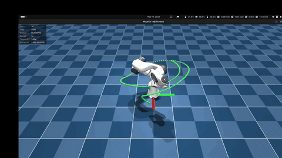
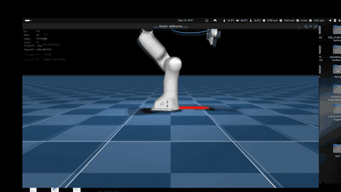
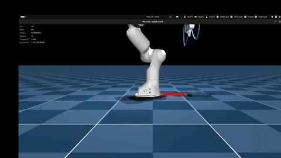
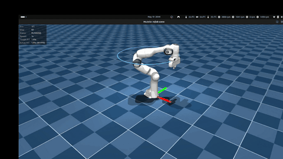

# EE Tracking on a Franka Panda

A reinforcement-learning policy that drives a 7-DOF Franka Panda to track arbitrary 3D end-effector trajectories (position and orientation) while staying robust to sensor noise, action delay, and dynamics mismatch.

Built on [mjlab](https://github.com/mujocolab/mjlab) (MuJoCo Warp + Isaac-Lab-style manager API) and RSL-RL PPO.

<p align="center"></p>

> Full-length trajectory videos and a trained checkpoint are available on [Google Drive](https://drive.google.com/drive/folders/1FV2seWvB1z4FqsR76jGBUxVuaU7bUp-L?usp=sharing) (the repo only ships GIFs to keep it lightweight).

## Quick start

```bash
curl -LsSf https://astral.sh/uv/install.sh | sh
git clone https://github.com/valerio98-lab/hac2k26.git && cd hac2k26
uv sync

# train
uv run train Hac2k26-EETracking-Franka --num_envs 4096

# play a trained checkpoint
uv run play Hac2k26-EETracking-Franka --checkpoint-file <path>
```

Training takes about three hours on a single RTX 4070.

## The problem

Tracking 3D end-effector trajectories on a 7-DOF arm is something classical model-based / task-space controllers do well in clean simulation. Three things break that recipe and motivate using RL here:

1. **Sensor noise** on joint positions and velocities corrupts the state used for IK.
2. **Action delay** between the policy decision and the actuator response makes the controller chase a stale target.
3. **Dynamics mismatch** (link masses, joint friction) shifts the actual response away from the nominal model used to design the controller.

A fourth requirement, smoothness, is implicit but essential: a policy that tracks the target by jittering at 50 Hz is useless on real hardware. Each design choice below is a direct answer to one of these.

## Design choices

**1. Smoothness: delta-joint actions + jerk penalty.**

The policy outputs *deltas* on the current joint configuration, not absolute joint targets:

```
q_des,t = q_t + clip(a_t, -0.1, 0.1)        a_t ∈ ℝ⁷
```

Zero output means "hold pose": smoothness is built into the parameterization, not bolted on as a regularizer. This is the standard choice in modern humanoid RL (DeepMimic-style residual actions on top of a reference). On top, the reward includes explicit penalties on action rate and action jerk:

```
r_rate = −‖a_t − a_{t-1}‖²
r_jerk = −‖a_t − 2 a_{t-1} + a_{t-2}‖²
```

The rate term tames first-order jitter; the jerk term kills the high-frequency oscillation that appears once the rate penalty is dialled in.

**2. Sparse reward landscape: two-scale Gaussian kernels.**

The natural reward for tracking is a Gaussian on the error, `r = exp(−α e²)`. With a single α you face a dilemma: a small α gives a wide basin and dense gradient when far from the target, but no signal at sub-cm scale; a large α gives sharp gradient when close but is flat everywhere else. This is the *cliff effect*: the policy gets no learning signal until it stumbles inside the narrow basin.

The reward sums two kernels, coarse and fine:

```
r_pos = (1 − f_w) · exp(−α_c · e_p²) + f_w · exp(−α_f · e_p²)
```

The coarse term provides gradient at large errors; the fine term provides gradient at small errors. An unbounded L2 penalty sits underneath so the policy can't drift when both kernels saturate:

```
r_L2 = −‖e_p‖²
```

The same formulation is used for orientation, on the geodesic angle between target and current EE quaternion. Two small auxiliary terms close out the reward: a velocity-alignment bonus that rewards moving along the reference tangent, and a one-sided singularity barrier that activates only when the arm approaches a singular configuration.

```
r_vel  = v_ee · v̂_ref
r_sing = −max(0, w_min − w(q))²
```

**3. Action delay: lookahead window + asymmetric actor-critic.**

A buffered command lag of 1–5 control steps is active throughout training. A naive policy would always be late: it observes the current target, decides an action, and that action lands 20–100 ms later, on a target that has moved.

Two ingredients make compensation possible:

- The observation includes an explicit **lookahead window** of 5 future reference samples at 50 ms spacing. The policy can see where the target is going, not just where it is now.
- The architecture is **asymmetric**: the actor sees noisy, delayed observations; the critic sees clean ground truth. The critic provides high-fidelity value estimates without paying the cost of inferring the world from a corrupted input.

The policy learns to aim ahead in time, so that by the moment the action reaches the simulator the EE is on the reference. The Results section below shows the consequence directly: tracking *improves* when the training-time delay is active, because removing it breaks the compensation the policy has learned.

**4. Reference design: random quintic splines in cylindrical coordinates.**

A tracking policy is only as smooth as the reference it follows. A target trajectory with discontinuities in velocity or acceleration forces the policy to either reproduce them (jitter) or lag behind. The reference here is a sequence of quintic polynomials:

```
p(τ) = c₀ + c₁ τ + c₂ τ² + c₃ τ³ + c₄ τ⁴ + c₅ τ⁵
```

with six coefficients pinned by six boundary conditions at each segment endpoint (position, velocity, zero acceleration). This gives C² continuity at every waypoint and bounds the jerk by construction. There is no infinite spike for the policy to fight.

The choice has a second purpose: generalization. Trajectories are randomly resampled every six seconds, a different spline through six random waypoints each time. The policy never sees the same trajectory twice and is forced to learn *tracking*, not memorization. This is what makes the OOD generalization to circle and figure-8 at evaluation time possible (see Results).

**How I got to the cylindrical fit.** The first version used straight-line segments between waypoints. Tracking was extremely accurate locally but fragile out of distribution: the policy nailed the random splines it was trained on and even shapes not seen during training, but failed on extreme OOD shapes like the r = 0.4 m circle at evaluation. I widened the workspace sampling to push more variety into training, and a new problem appeared — some Cartesian segments now passed through the base of the robot. Fitting the spline in cylindrical (r, θ, z) coordinates and mapping back to Cartesian fixed both at once: the lift arcs around the base, and a minimum radius keeps the spline away from the shoulder-wrist singularity region.

The remaining geometric details:

- Interior waypoint velocities use a centripetal Catmull-Rom tangent, scaled by a curriculum coefficient that ramps from rest-to-rest motion (with brief stops at every waypoint) to fully continuous flow.
- Orientation is generated independently: random target quaternions at each waypoint, interpolated with the same quintic smoothstep applied to the axis-angle log. The result is SLERP-equivalent and has zero angular velocity at every waypoint.

## Training stack

**Observation.** 77 scalars per step, grouped so the count is verifiable:

- proprio (21): joint positions (7), joint velocities (7), last action (7)
- EE state (15): position (3), 6D orientation (6), linear velocity (3), angular velocity (3)
- reference (28): target position (3), target velocity (3), target 6D orientation (6), phase variable (1), 5-step lookahead of future positions (3 × 5)
- tracking errors (12): position (3), linear velocity (3), orientation as axis-angle (3), angular velocity (3)
- manipulability (1)

The critic sees the same terms with the noise stripped.

**Uncertainty sources**, all active during training:

- Observation noise: uniform, on every measurement-like channel (proprio, EE state, tracking errors). Reference signals stay clean: they are commands input into the policy, not sensor readings.
- Action delay: each command held in a buffer for a stochastic 1–5 control steps before reaching the simulator.
- Domain randomization: link inertia (±15%) and joint friction (0–0.2 N·m), resampled at every episode reset.

**RL.** PPO, asymmetric actor-critic, three-layer MLP (512-256-128) with ELU activations. 4096 parallel envs, up to 10k iterations.

## Results

Full uncertainty stack unless stated. `p50` and `p95` are the median and the 95th percentile across 256 parallel envs.

| | Pos RMSE [mm] | Ori RMSE [deg] | Jerk RMS [m/s³] |
|---|---:|---:|---:|
| Training distribution, p50 (256 envs)   | 15.2 | 3.8  | 125  |
| Training distribution, p95              | 61   | 18.5 | 237  |
| Circle, r = 15 cm (OOD)                 | **6.5**  | 1.7  | 19.8 |
| Figure-8, scale = 18 cm (OOD)           | **6.3**  | 1.7  | 33.6 |

Circle and figure-8 are out-of-distribution: the policy only ever saw random quintic splines during training. It generalizes because the reference signal is shape-agnostic (target pose, velocity, phase, lookahead), so any sufficiently smooth reference looks the same to the policy.

**Robustness ablation** (same checkpoint, varying uncertainty at evaluation):

| | Circle [mm] | Figure-8 [mm] |
|---|---:|---:|
| Noise only                              | 8.0 | 9.0 |
| Noise + action delay                    | **6.5** | **6.3** |
| Noise + delay + DR                      | 6.7 | 7.2 |

The policy tracks *best* when the training-time delay is active, not when it is removed. During training the policy learns to use the lookahead window to anticipate the delay: it aims a few control steps ahead, so by the time the action reaches the simulator the EE is on the reference. Removing the delay at evaluation time breaks this compensation. The action lands immediately while the policy is still aiming ahead, producing a small but consistent overshoot. Adding domain randomization on top costs at most ~1 mm.

## Videos

<p align="center">
  
  
</p>

Small circle (r = 20 cm) and figure-8 (scale = 30 cm). A larger circle (r = 40 cm) reaches the edge of the trained workspace; the policy still tracks, with localized jitter, graceful degradation as the reference approaches the workspace boundary.

<p align="center"></p>

## Reproducing

```bash
# Deterministic circle + figure-8
uv run python -m hac2k26.eval.run \
    --checkpoint logs/rsl_rl/franka_ee_tracking/<run>/model_<iter>.pt \
    --output-dir eval_outputs/rl \
    --trajectories circle figure8 --disable-dr

# Training-distribution stats across 256 parallel envs
uv run python scripts/eval_random.py \
    --checkpoint logs/rsl_rl/franka_ee_tracking/<run>/model_<iter>.pt \
    --num-envs 256
```

Add or remove `--disable-action-delay` and `--disable-dr` to reproduce the robustness ablation.

## Code layout

```
src/hac2k26/
  ee_tracking/
    tracking_env_cfg.py       env factory: obs, rewards, events, command
    config/franka/            task registration + PPO hyperparameters
    mdp/
      commands.py             quintic-spline reference generator
      actions.py              Δ-joint action with delay buffer
      rewards.py              tracking + smoothness + singularity
      observations.py         actor/critic observation terms
      kinematics.py           manipulability via warp Jacobian
      events.py               reset + domain randomization
  eval/run.py                 deterministic evaluation entry point
scripts/                      training-distribution eval, plotting, play
```

PPO hyperparameters in `src/hac2k26/ee_tracking/config/franka/rl_cfg.py`. Environment and trajectory parameters in `src/hac2k26/ee_tracking/tracking_env_cfg.py`.
